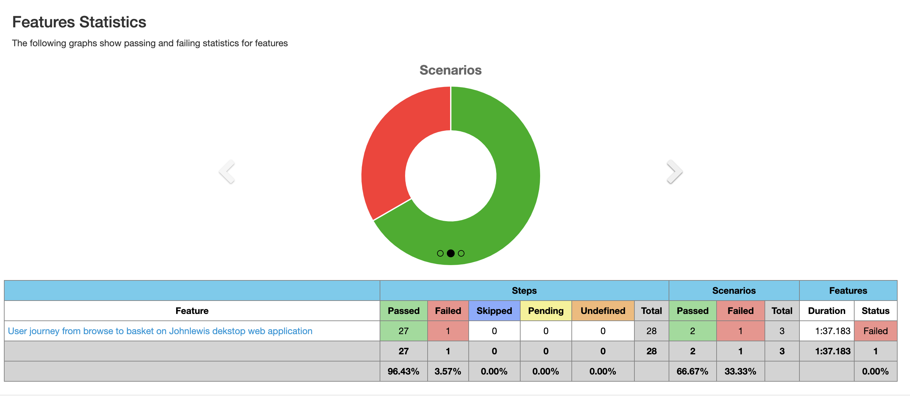
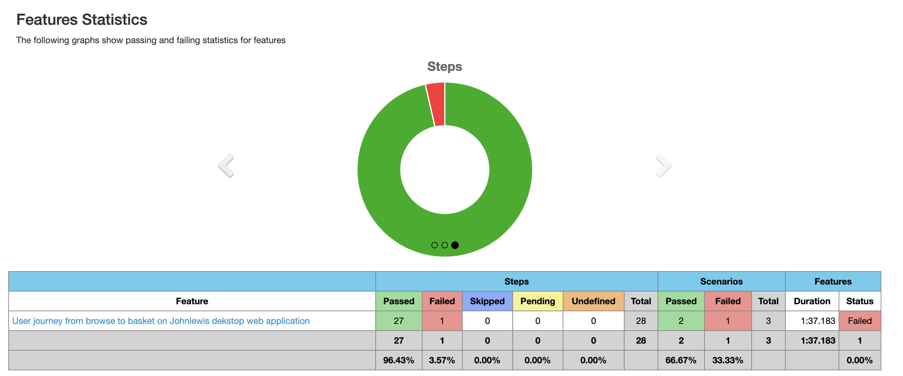
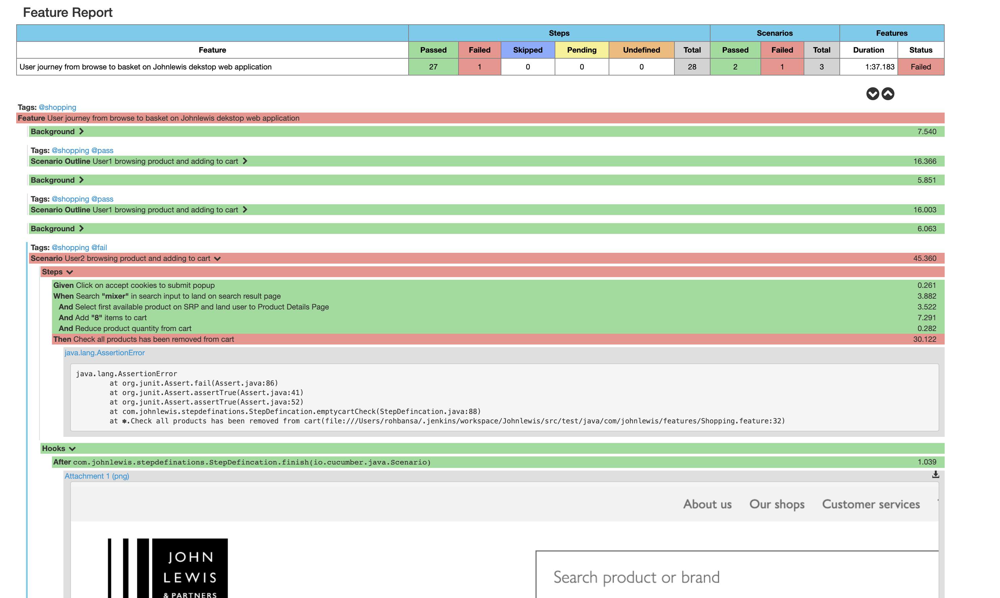

**Assignment:**

Create a user journey test from scratch in a automation framework of your choice for
          the John Lewis website(https://www.johnlewis.com/), which;
           
          1) accepts the cookie banner
          2) browses for any product or products(s) of your choice
          3) selects multiple quantities of that product or product(s)
          4) adds the selected product to basket
          5) deletes product or products(s) quantities from the basket
          6) clears cookies at the end of the test.
 
 **Automation Approach**
 
 Created front end validation BDD automation framework with Page Object Model(POM) design pattern approach where separate class for page interacts with each other to complete scenarios
 
 
 **Tools/language integrate to complete E2E journey:**

•	Java
•	Selenium Webdriver
•	Maven
•	Cucumber
•	Git
•	Jenkins
  
**Execution detail:**

CLI Command to run test suite : **mvn clean test -Dcucumber.options="--tags @shopping"**

In Shopping.feature file, add two scenarios for user journey. First scenario will pass and failing second scenario explicitly to capture screenshots of screen to attach with cucumber report.

Please find attached visual for overall journey and cucumber report

**Features Statistics**

                      
